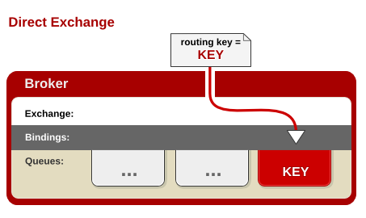

## RabbitMQ Exchange 模式

#### 一、Direct Exchange

任何发送到 Direct Exchange 的消息都会被转发到 RouteKey 中指定的Queue。
1.一般情况可以使用rabbitMQ自带的Exchange: "" (该Exchange的名字为空字符串，下文称其为default Exchange)。
2.这种模式下不需要将Exchange进行任何绑定(binding)操作
3.消息传递时需要一个"RouteKey"，可以简单的理解为要发送到的队列名字。
4.如果vhost中不存在RouteKey中指定的队列名，则该消息会被抛弃。

Direct模式,可以使用rabbitMQ自带的Exchange：default Exchange 。所以不需要将Exchange进行任何绑定(binding)操作 。消息传递时，RouteKey必须完全匹配，才会被队列接收，否则该消息会被抛弃。所以不需要将Exchange进行任何绑定(binding)操作 。消息传递时，RouteKey必须完全匹配，才会被队列接收，否则该消息会被抛弃。

#### 二、Fanout Exchange

任何发送到 Fanout Exchange 的消息都会被转发到与该 Exchange 绑定(Binding)的所有Queue上

1.可以理解为路由表的模式
2.这种模式不需要 RouteKey
3.这种模式需要提前将Exchange与Queue进行绑定,一个Exchange可以绑定多个Queue,一个Queue可以同多个Exchange进行绑定。
4.如果接受到消息的Exchange没有与任何Queue绑定，则消息会被抛弃。

  Fanout Exchange 不需要处理RouteKey。只需要简单的将队列绑定到exchange 上。
  这样发送到exchange的消息都会被转发到与该交换机绑定的所有队列上。类似子网广播，每台子网内的主机都获得了一份复制的消息。
  所以，Fanout Exchange 转发消息是最快的。

#### 三、Topic Exchange

任何发送到Topic Exchange的消息都会被转发到所有关心RouteKey中指定话题的Queue上
1.这种模式较为复杂,简单来说,就是每个队列都有其关心的主题,所有的消息都带有一个"标题"(RouteKey),Exchange会将消息转发到所有关注主题能与RouteKey模糊匹配的队列。
2.这种模式需要RouteKey,也许要提前绑定Exchange与Queue
3.在进行绑定时，要提供一个该队列关心的主题，如“#.log.#”表示该队列关心所有涉及log的消息(一个RouteKey为”MQ.log.error”的消息会被转发到该队列)。
4."#"表示0个或若干个关键字,"*"表示一个关键字。如"log.*"能与"log.warn"匹配，无法与"log.warn.timeout"匹配；但是"log.#"能与上述两者匹配。
5.同样，如果Exchange没有发现能够与RouteKey匹配的Queue，则会抛弃此消息。

　　所有发送到Topic Exchange的消息被转发到所有关心RouteKey中指定Topic的Queue上，

　　Exchange 将RouteKey 和某Topic 进行模糊匹配。此时队列需要绑定一个Topic。可以使用通配符进行模糊匹配，符号“#”匹配一个或多个词，符号“*”匹配不多不少一个词。因此“log.#”能够匹配到“log.info.oa”，但是“log.*” 只会匹配到“log.error”。

####  参考

    http://www.cnblogs.com/zhangweizhong/p/5713874.html
    http://www.gaort.com/index.php/archives/366
    
    http://blog.csdn.net/zhangbinalan/article/details/37766859