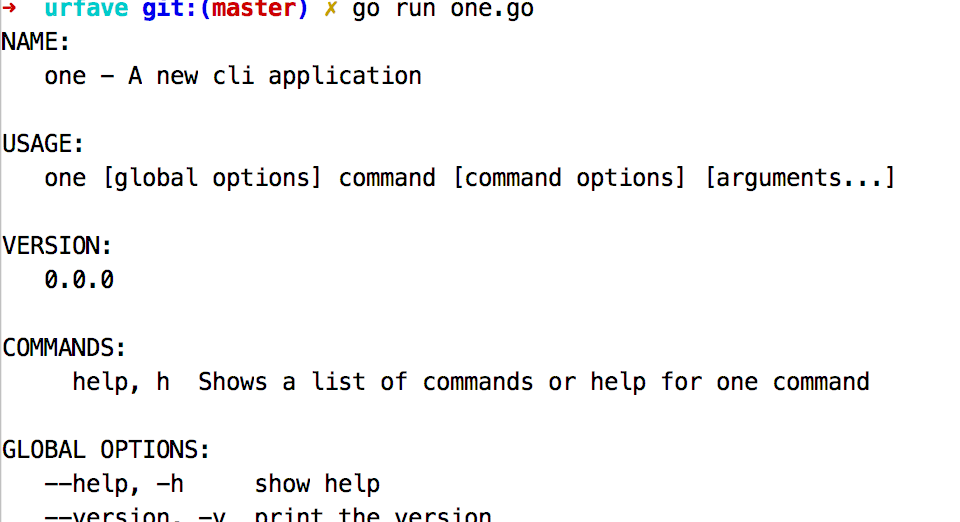
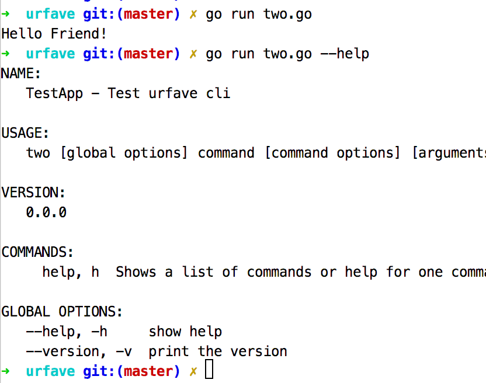

#### go语言的命令行库

  `1` one 

    package main
    
    import (
        "os"
        "github.com/urfave/cli"
    )
    
    func main()  {
        cli.NewApp().Run(os.Args)
    }
    
  
  
  `2` two
  
    package main
    
    import (
        "fmt"
        "os"
        "github.com/urfave/cli"
    )
    
    func main() {
        app := cli.NewApp()
        app.Name = "TestApp"
        app.Usage = "Test urfave cli"
        app.Action = func(c *cli.Context) error {
            fmt.Println("Hello Friend!")
            return nil
        }
        app.Run(os.Args)
    }
    
  
  
  
  `3` three
  
    package main
    
    import (
        "fmt"
        "os"
        "github.com/urfave/cli"
    )
    
    func main() {
        app := cli.NewApp()
        app.Action = func(c *cli.Context) error {
            fmt.Printf("Hello %q \n", c.Args().Get(0))
            return nil
        }
        app.Run(os.Args)
    
    }

  `4` four
  
    package main
    import (
        "fmt"
        "os"
        "github.com/urfave/cli"
    )
    
    func main() {
        app := cli.NewApp()
    
        app.Flags = []cli.Flag {
            cli.StringFlag{
                Name: "lang",
                Value: "english",
                Usage: "language for the test",
            },
        }
    
        app.Action = func(c *cli.Context) error {
            name := "Test"
            if c.NArg() > 0 {
                name = c.Args().Get(0)
            }
    
            if c.String("lang") == "spanish" {
                fmt.Println("hola", name)
            } else {
                fmt.Println("Hello", name)
            }
            return nil
        }
        app.Run(os.Args)
    }
    
    //  go run four.go --lang spanish
